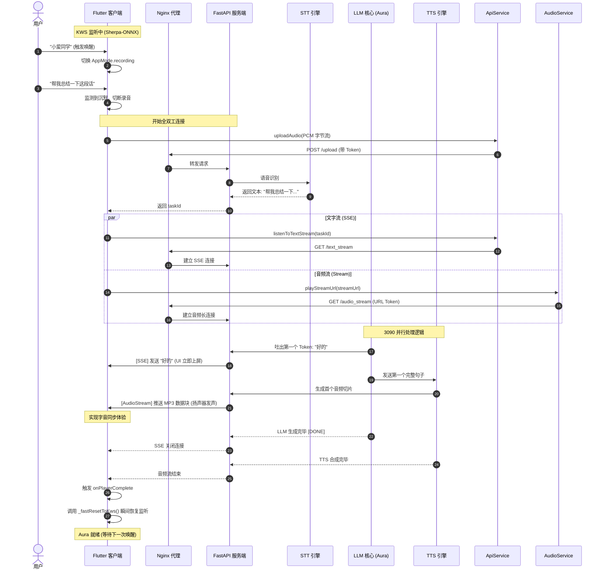

# Aura: A Non-contact Reading Assistant

<div align="left">


</div>


## 🌌 Never Contact, Never Distract. Just Interact!

Aura is designed as a non-contact reading assistant to preserve the flow of deep, immersive reading.

Aura aims to solving the distraction pain point. Traditional reading is often interrupted when encountering rare characters, obscure concepts, or complex historical backgrounds. The process of "putting down the book -> unlocking a phone -> searching for information" is not only cumbersome but also a major source of digital distraction.

Aura solves this by enabling a completely hands-free inquiry experience:

- Stationary Setup: The smartphone is placed on a stand, serving as the "eyes" (camera) and "ears" (microphone) of the system.

- Voice-Driven Interaction: Users control the dialogue and trigger functions (like taking photos for OCR) entirely via voice.

- Seamless I/O: Audio is handled through a headset, while brief text results (definitions, backgrounds) are pushed to a Smartwatch. This ensures the user stays physically and mentally focused on the book without ever touching a screen.

The Roadmap: In later stages, Aura will transition from a desk-bound assistant to a wearable one. By using a chest-mounted strap or bracket, we aim to empower the system with outdoor interactive capabilities, making it a ubiquitous companion for both indoor study and outdoor exploration.

## 🏗️ Architecture: Device-Edge-Cloud Collaboration


Aura operates on a tri-layer synergy to provide high-performance, intelligent assistance:

### Device (Interaction Layer)

Interaction layer includes all kinds of wearable devices, such as smartphones (with camera, mic. I/O), smartwatches (with text display), and earbuds (with mic. I/O).

These devices are responsible for local sensory processing, keyword Spotting (KWS), and UI/UX coordination.

The tech stack includes Flutter, Sherpa-ONNX, and so on.


### Edge (Gateway Layer)

Gateway layer is composed of consumer-grade edge computing nodes, specifically an RTX 3090 GPU server or a private laboratory workstation.

This layer manages high-latency and privacy-sensitive tasks, providing SSL termination through Nginx, high-speed Speech-to-Text (STT), and ultra-realistic Voice Synthesis (TTS).

The tech stack for now involves FastAPI, Nginx, Faster-Whisper, and CosyVoice.

### Cloud (Intelligence Layer)

Intelligence layer provides advanced cognitive power through the integration of Large Language Model (LLM) APIs or dedicated local large models.

It is responsible for high-level reasoning, complex knowledge retrieval, and context-aware summarization of reading materials.

We currently deploy a Gemma4-31B model locally on a powerful computing node using Ollama framework. The Ollama API can be substituted with any other available LLM service provider.

## Current Workflow



## ⚙️ Development Setup

### 🌐 Network Setup

Aura utilizes a dual-authentication mechanism (HTTP Header for SSE/Uploads and URL Token for media streams) over an Nginx reverse proxy.

Please refer to our dedicated network guide [Network Configuration Guide](docs/Network%20Configuration.md) for detailed instructions on configuring Nginx (SSL termination, disabling buffers for SSE), iptables rules, and router port forwarding.

### ☁️ Cloud: Service Setup

We locally deploy a `gemma4:31b` model using Ollama as the LLM service. Any API compatible with Ollma API also work

### 💻 Edge: Server Setup

The server components are highly recommended to run in an isolated Docker container or a host machine equipped with an Nvidia GPU (e.g., RTX 3090).

**1. Prerequisites**

- Python 3.10+

- CUDA Toolkit (11.8 / 12.1)

- Available Ollama API

Install required Python packages:

```shell
pip install fastapi uvicorn pydantic faster-whisper httpx python-dotenv pydub
```

**2. Model Downloads & Configuration**

(1) CosyVoice (TTS)

Aura utilizes [CosyVoice](https://github.com/FunAudioLLM/CosyVoice.git) for high-fidelity streaming synthesis. You can clone its code by updating the submodules in our repository:

```shell
git submodule update --init --recursive
```

Download the pre-trained models (e.g., the 0.5B version) to `services/cosy_voice/pretrained_models/` according to the official CosyVoice documentation. 

A Voice prompt is quite important for Cosy Voice model. Since we are using the `inference_cross_lingual()` API, you can specify a sharp `.wav` audio in any language and move it into `services/cosy_voice/assets/`. We recommend you to consider the voices shown by the official [demo](https://funaudiollm.github.io/cosyvoice2/#Zero-shot%20In-context%20Generation).

You can also find APIs for EdgeTTS in our code. However, since EdgeTTS has a strict rate limit, continuous conversation may suffer from the `No audio was received` error.

(2) Faster-Whisper (STT)

The large-v3-turbo model will be automatically downloaded during the first execution. Ensure your server has active internet access.

**3. Environment Variables (.env)**

Create a `.env` file in the `gateway` directory for authentication:

```
AURA_API_KEY=your_ultra_secret_key_here
```

The `load_dotenv()` function in `gateway/aura_server.py` will load this variable automatically.

**4. Running the Service**

Launch the FastAPI server:

```shell
cd gateway && python aura_server.py
```

### 📱 Device: App Setup

The app is built with Flutter and heavily optimized for Android's underlying audio and network security mechanisms.

**1. Prerequisites**

- Flutter SDK `~3.32.5`
- Native Development Kit `27.0.12077973`

**2. Environment Variables (.env)**

To keep sensitive configurations separated from the codebase, create a `.env` file in the root of your Flutter project. Ensure this file is added to your .gitignore:

```shell
AURA_SERVER_IP=your_server_public_ip
AURA_SERVER_PORT=8443
AURA_API_KEY=your_ultra_secret_key_here
```

Verify that the `.env` path is correctly declared in your `pubspec.yaml`:

```yaml
assets:
    - .env
```

**3. Sherpa-ONNX Wake Word Model**

Aura relies on Sherpa-ONNX for local Keyword Spotting (e.g., detecting the wake word).

Download the corresponding KWS ONNX model files from the [official Sherpa-ONNX releases](https://github.com/k2-fsa/sherpa-onnx/releases/download/kws-models/sherpa-onnx-kws-zipformer-zh-en-3M-2025-12-20.tar.bz2). Since these files will be synchronized to your device, you can remove irrelevant ones to reduce storage consumption. For ONNX files, only `decoder-`, `encoder-`, and `joiner-` files with postfix `epoch-13-avg-2-chunk-16-left-64.onnx` are needed. `tokens.txt` and `en.phone` are also demanded for inference.

Additionally, you need to generate the `keywords.txt` file to specify wake-up words. First, define your wake-up words in `keywords_raw.txt` like

```shell
小爱同学 @小爱同学
```

Next, use the official CLI tool to process it

```shell
sherpa-onnx-cli text2token \
    --tokens assets/kws_model/tokens.txt \
    --tokens-type phone+ppinyin \
    --lexicon assets/kws_model/en.phone \
    assets/kws_model/keywords_raw.txt keywords.txt
```

Place the model files and `keywords.txt` into the `app/assets/kws_model/` directory. Then verify that the asset path is correctly declared in your `pubspec.yaml`:

```yaml
assets:
  - assets/kws_model/
```

**4. Android Security Config for Self-Signed SSL**

To prevent the underlying Android MediaPlayer from blocking the audio stream due to our self-signed HTTPS certificate, you must inject the certificate into the native Android configuration:

After configuring the network following the tutorials in [Network Configuration](docs/Network%20Configuration.md), the file `aura.crt` would have been generated on your server. Copy the file to your Flutter project and place it exactly at: `android/app/src/main/res/raw/aura_cert.crt`.

**5. Build and Run**

To deploy the app to a physical device without a cable (ideal for stand-mounted scenarios):

- Enable Developer Options: Go to Settings -> About Phone -> Tap Build Number 7 times.
- Enable Wireless Debugging: Under Developer Options, toggle `USB Debugging` and `Wireless Debugging` to ON.
- Connect your phone and PC to the same Wi-Fi.
- Select Pair device with pairing code.
- On your host PC, download `adb` tools and run:
```
adb pair <ip_address>:<port>
# Enter the pairing code shown on phone
adb connect <ip_address>:<another_port>
```
- Run `adb devices` to ensure your device appears in the list before running the app.
- Run the commands below:
```shell
flutter clean
flutter pub get
flutter run
```

Important notes for your first run:

On the very first launch, the App will request Microphone permissions. You must select "Allow" or "While using the app." If denied, the Keyword Spotting (KWS) and Voice Interaction will fail silently.

When executing flutter run or installing via ADB, stay focused on your phone screen. Many Android skins (especially MIUI/HyperOS) display a security pop-up asking for permission to install via USB. You usually have only 10 seconds to tap "Install". If you miss this window, the installation will fail with the error: `installation canceled by user`.
