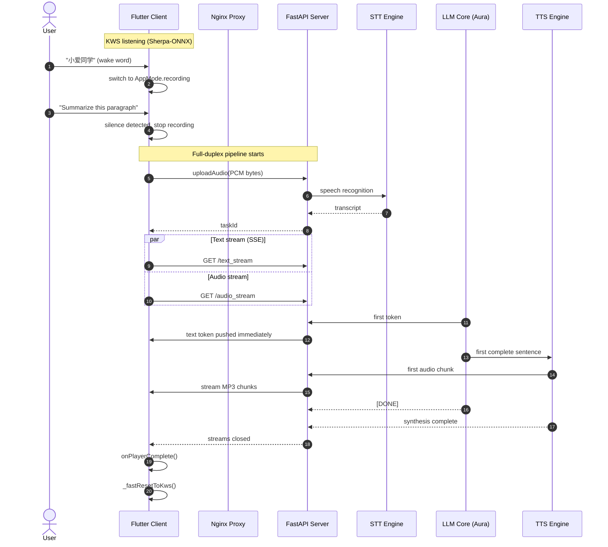

# Aura: A Non-Contact Reading Assistant

[English](README.md) | [简体中文](README.zh-CN.md)

<div align="left">


</div>


## Never Contact, Never Distract. Just Interact.

Aura is built for one thing: keeping readers in flow.

When you hit an unfamiliar word, historical reference, or difficult concept, traditional reading quickly turns into a context switch: put down the book, unlock your phone, search, scroll, get distracted. Aura removes that loop with a fully hands-free reading assistant.

- **Stationary setup**: your phone stays on a stand and acts as the system's camera and microphone.
- **Voice-first interaction**: wake, ask, and control features (including OCR capture) by voice.
- **Seamless output**: audio replies go to earbuds/headset, while short text snippets can be pushed to a smartwatch.

The long-term roadmap is wearable-first interaction (for example, chest-mounted setups), so Aura can assist both focused desk reading and outdoor learning scenarios.

## Architecture: Device-Edge-Cloud Collaboration


Aura uses a 3-layer architecture for responsiveness, privacy, and model flexibility.

### Device Layer (Interaction)

The device layer includes smartphones, smartwatches, and audio peripherals.

It handles local sensing, keyword spotting (KWS), and user interaction orchestration.

Primary stack: Flutter + Sherpa-ONNX.

### Edge Layer (Gateway)

The edge layer usually runs on a local GPU workstation (for example, RTX 3090).

It handles low-latency and privacy-sensitive workloads, including TLS termination (Nginx), speech recognition (STT), and neural speech synthesis (TTS).

Primary stack: FastAPI + Nginx + Faster-Whisper + CosyVoice.

### Cloud/Intelligence Layer

The intelligence layer provides reasoning and knowledge synthesis through LLM APIs or local models.

Current default: local `gemma4:31b` served by Ollama. You can replace Ollama with any compatible LLM endpoint.

## Current Workflow



## Development Setup

### Network Setup

Aura uses dual authentication behind Nginx:

- Header token for SSE and upload APIs
- URL token for media streams

See the full network guide: [Network Configuration Guide](docs/Network%20Configuration.md).

### Cloud Setup (LLM Service)

Run `gemma4:31b` locally with Ollama, or point Aura to any Ollama-compatible LLM API.

### Edge Setup (Gateway Server)

Running in Docker or on a host with an NVIDIA GPU is recommended.

#### 1) Prerequisites

- Python 3.10+
- CUDA Toolkit (11.8 or 12.1)
- Accessible Ollama API endpoint

Install dependencies:

```shell
pip install fastapi uvicorn pydantic faster-whisper httpx python-dotenv pydub
```

#### 2) Tooling and Model Configuration

**CosyVoice (TTS)**

Initialize submodules:

```shell
git submodule update --init --recursive
```

Download pretrained CosyVoice models (for example, 0.5B) into `services/cosy_voice/pretrained_models/`.

For cross-lingual synthesis via `inference_cross_lingual()`, place a clean prompt `.wav` file in `services/cosy_voice/assets/`. Official voice examples: [CosyVoice demo](https://funaudiollm.github.io/cosyvoice2/#Zero-shot%20In-context%20Generation).

EdgeTTS APIs are also available in this repository, but EdgeTTS rate limits can break long, continuous conversations.

**Faster-Whisper (STT)**

The `large-v3-turbo` model downloads automatically on first run. Ensure internet access on the server during initialization.

**SearXNG**

Follow the [official installation docs](https://docs.searxng.org/admin/installation.html). If your environment requires a proxy, configure `/etc/searxng/settings.yml` accordingly.

If you need global search engines behind regional network restrictions, run an available proxy at `127.0.0.1:7890` (for example, using [mihomo](https://github.com/MetaCubeX/mihomo/releases)).

#### 3) Environment Variables

Create `.env` in `gateway/`:

```env
AURA_API_KEY=your_ultra_secret_key_here
```

#### 4) Run Gateway Service

```shell
cd gateway && python aura_server.py
```

### Device Setup (Flutter App)

The app is optimized for Android audio and network-security behavior.

#### 1) Prerequisites

- Flutter SDK `~3.32.5`
- Android NDK `27.0.12077973`

#### 2) Environment Variables

Create `.env` in `app/` (and keep it out of version control):

```env
AURA_SERVER_IP=your_server_public_ip
AURA_SERVER_PORT=8443
AURA_API_KEY=your_ultra_secret_key_here
```

Ensure `.env` is included in `app/pubspec.yaml`:

```yaml
assets:
  - .env
```

#### 3) Sherpa-ONNX Wake Word Model

Download KWS model files from [Sherpa-ONNX releases](https://github.com/k2-fsa/sherpa-onnx/releases/download/kws-models/sherpa-onnx-kws-zipformer-zh-en-3M-2025-12-20.tar.bz2).

Generate wake-word tokens:

```shell
sherpa-onnx-cli text2token \
  --tokens assets/kws_model/tokens.txt \
  --tokens-type phone+ppinyin \
  --lexicon assets/kws_model/en.phone \
  assets/kws_model/keywords_raw.txt keywords.txt
```

Place model files and `keywords.txt` in `app/assets/kws_model/`, then verify:

```yaml
assets:
  - assets/kws_model/
```

#### 4) Android Security Config (Self-Signed TLS)

After network setup, copy `aura.crt` to:

`app/android/app/src/main/res/raw/aura_cert.crt`

This prevents Android media playback from rejecting the HTTPS audio stream.

#### 5) Build and Run

For wireless deployment to a physical Android device:

```shell
adb pair <ip_address>:<port>
adb connect <ip_address>:<another_port>
adb devices
```

Then run:

```shell
flutter clean
flutter pub get
flutter run
```

First-run notes:

- Grant microphone permission, or KWS and voice interaction will fail.
- Some Android ROMs (for example MIUI/HyperOS) show short-lived install prompts during ADB install; missing them can trigger `installation canceled by user`.
