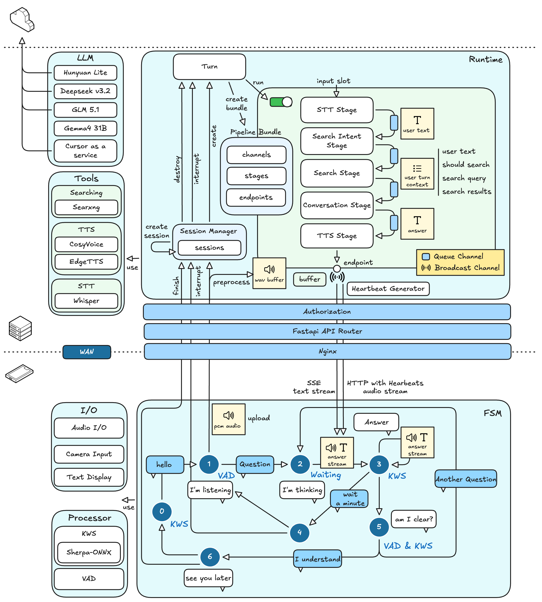
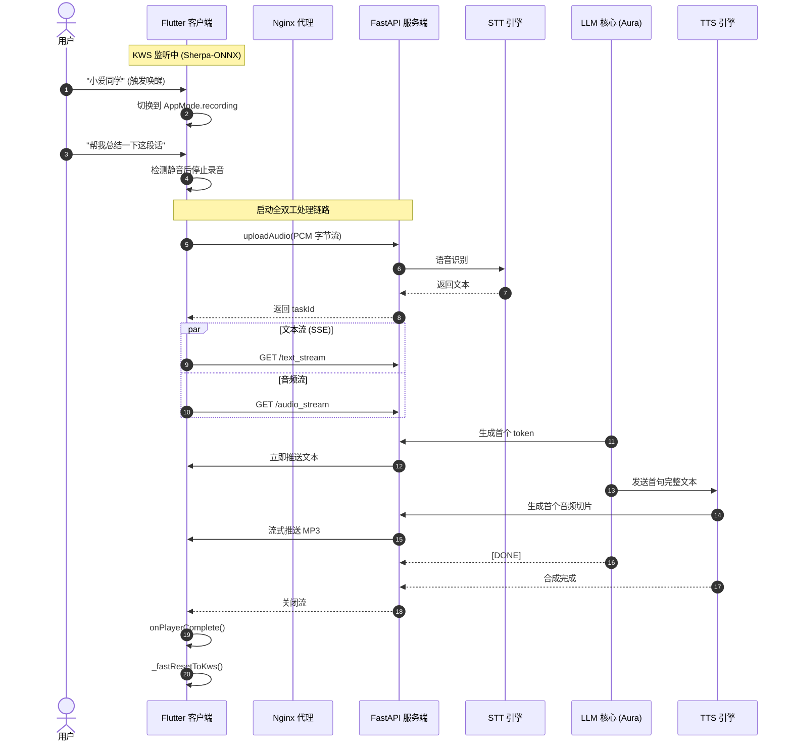

# Aura：非接触式阅读助手

[English](README.md) | [简体中文](README.zh-CN.md)

<div align="left">


</div>


## 不碰屏幕，不断状态，只管阅读

Aura 的目标很直接：让你在阅读中始终保持专注心流。

读书时遇到生词、典故、陌生背景知识，传统做法往往是放下书、解锁手机、搜索、跳转网页，很容易分心。Aura 用全语音、免接触的交互方式，把这段中断流程直接抹平。

- **固定式摆放**：手机放在支架上，充当系统的“眼睛”（相机）和“耳朵”（麦克风）。
- **语音优先交互**：唤醒、提问、触发功能（含 OCR 拍照）都可通过语音完成。
- **无缝结果输出**：语音回复走耳机，简短文本（释义、背景）可推送到手表。

后续路线是向可穿戴方向演进（例如胸前固定方案），覆盖桌面学习与户外探索两类场景。

## 架构设计：端-边-云协同



Aura 采用三层协同架构，在响应速度、隐私和模型能力之间取得平衡。

### Device 层（交互层）

包括手机、手表、耳机等终端设备。

负责本地感知、关键词唤醒（KWS）和交互编排。

核心技术栈：Flutter + Sherpa-ONNX。

### Edge 层（网关层）

通常部署在本地 GPU 工作站（例如 RTX 3090）。

负责低延迟和隐私敏感任务，包括 TLS 终止（Nginx）、语音识别（STT）和神经语音合成（TTS）。

核心技术栈：FastAPI + Nginx + Faster-Whisper + CosyVoice。

### Cloud/Intelligence 层（智能层）

通过 LLM API 或本地大模型提供推理与知识整合能力。

当前默认方案：本地 Ollama 部署 `gemma4:31b`。也可替换为兼容接口的其他 LLM 服务。

## 当前工作流



## 开发环境配置

### 网络配置

Aura 在 Nginx 反向代理后采用双鉴权：

- SSE/上传接口使用 Header Token
- 媒体流接口使用 URL Token

详细配置请参考：[网络配置指南](docs/Network%20Configuration.zh-CN.md)。

### Cloud 配置（LLM 服务）

可通过 Ollama 本地运行 `gemma4:31b`，也可接入任意兼容 Ollama API 的模型服务。

### Edge 配置（网关服务）

建议在 Docker 容器中运行，或直接部署在带 NVIDIA GPU 的主机上。

#### 1）前置依赖

- Python 3.10+
- CUDA Toolkit（11.8 或 12.1）
- 可访问的 Ollama API

安装依赖：

```shell
pip install fastapi uvicorn pydantic faster-whisper httpx python-dotenv pydub
```

#### 2）工具与模型配置

**CosyVoice（TTS）**

初始化子模块：

```shell
git submodule update --init --recursive
```

按官方文档将预训练模型（如 0.5B）放入 `services/cosy_voice/pretrained_models/`。

若使用 `inference_cross_lingual()`，请将干净的提示音 `.wav` 放入 `services/cosy_voice/assets/`。示例音色可参考 [CosyVoice demo](https://funaudiollm.github.io/cosyvoice2/#Zero-shot%20In-context%20Generation)。

仓库中也保留了 EdgeTTS 接口，但 EdgeTTS 速率限制较严格，长对话时可能出现 `No audio was received`。

**Faster-Whisper（STT）**

首次运行会自动下载 `large-v3-turbo` 模型，请确保服务器联网。

**SearXNG**

请参考 [官方安装文档](https://docs.searxng.org/admin/installation.html)。如需代理访问，按实际网络环境配置 `/etc/searxng/settings.yml`。

若要在受限网络下访问国际搜索引擎，可在 `127.0.0.1:7890` 提供代理（例如 [mihomo](https://github.com/MetaCubeX/mihomo/releases)）。

#### 3）环境变量

在 `gateway/` 下创建 `.env`：

```env
AURA_API_KEY=your_ultra_secret_key_here
```

#### 4）启动网关服务

```shell
cd gateway && python aura_server.py
```

### Device 配置（Flutter 客户端）

客户端针对 Android 的音频链路与网络安全机制做了优化。

#### 1）前置依赖

- Flutter SDK `~3.32.5`
- Android NDK `27.0.12077973`

#### 2）环境变量

在 `app/` 下创建 `.env`（并加入 `.gitignore`）：

```env
AURA_SERVER_IP=your_server_public_ip
AURA_SERVER_PORT=8443
AURA_API_KEY=your_ultra_secret_key_here
```

确保 `app/pubspec.yaml` 已声明：

```yaml
assets:
  - .env
```

#### 3）Sherpa-ONNX 唤醒模型

从 [Sherpa-ONNX releases](https://github.com/k2-fsa/sherpa-onnx/releases/download/kws-models/sherpa-onnx-kws-zipformer-zh-en-3M-2025-12-20.tar.bz2) 下载 KWS 模型文件。

生成唤醒词 token：

```shell
sherpa-onnx-cli text2token \
  --tokens assets/kws_model/tokens.txt \
  --tokens-type phone+ppinyin \
  --lexicon assets/kws_model/en.phone \
  assets/kws_model/keywords_raw.txt keywords.txt
```

将模型文件和 `keywords.txt` 放到 `app/assets/kws_model/`，并确认：

```yaml
assets:
  - assets/kws_model/
```

#### 4）Android 自签名证书配置

网络配置完成后（参考[网络配置指南](docs/Network%20Configuration.zh-CN.md)），将 `aura.crt` 复制到：

`app/android/app/src/main/res/raw/aura_cert.crt`

这样可以避免 Android 媒体播放链路拒绝 HTTPS 音频流。

#### 5）构建与运行

无线部署到 Android 真机：

```shell
adb pair <ip_address>:<port>
adb connect <ip_address>:<another_port>
adb devices
```

然后执行：

```shell
flutter clean
flutter pub get
flutter run
```

首次运行注意：

- 必须授予麦克风权限，否则 KWS 与语音交互不会正常工作。
- 部分 Android ROM（如 MIUI/HyperOS）安装弹窗停留时间较短，错过会触发 `installation canceled by user`。
