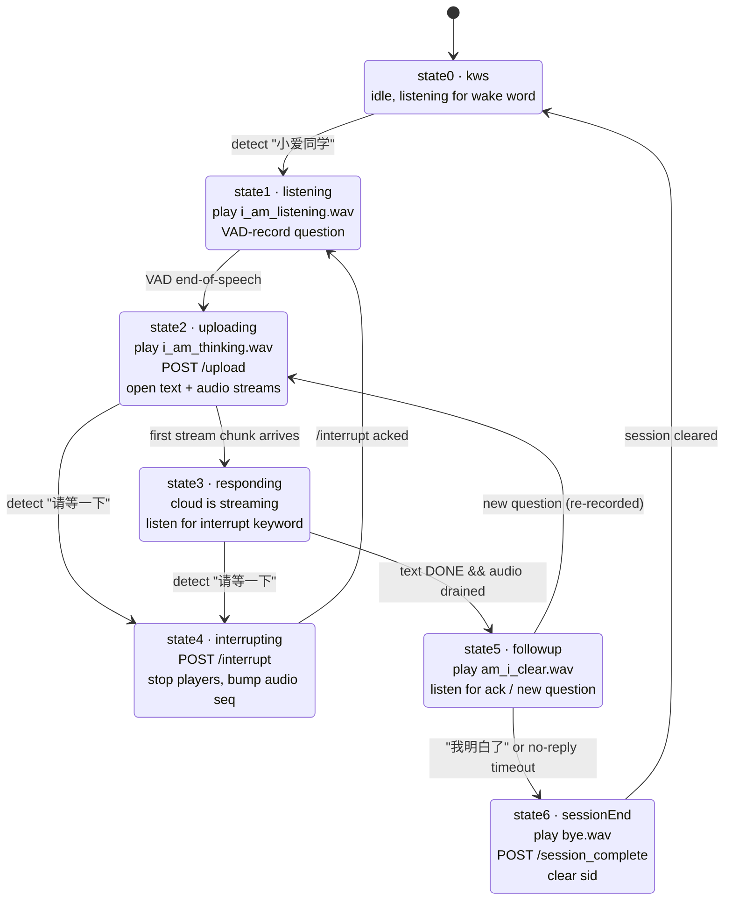

# Aura — Flutter Client

The on-device half of Aura: a hands-free, multi-turn voice assistant that wakes
on a keyword, streams the user's question to a cloud LLM/TTS gateway, and plays
the answer back as it is being generated.

The client is a single Flutter app (`lib/main.dart` → `AuraController`) that
owns a small finite state machine, a few audio players, a microphone stream,
and a keyword spotter. There is no other UI logic worth speaking of — the app
is essentially the FSM plus a status text.

## Project layout

```
app/
  lib/
    main.dart        # entry + minimal UI bound to AuraController
    controller.dart  # 7-state FSM (AuraController)
    services.dart    # ApiService, AudioService, KwsService
    config.dart      # env-driven URL, audio/VAD thresholds, keyword strings
  assets/
    wav/             # i_am_listening, i_am_thinking, am_i_clear, bye
    kws_model/       # sherpa-onnx KWS model + keywords.txt (pinyin tokens)
```

Stack: `sherpa_onnx` for KWS, `record` for the mic stream, `audioplayers` for
both local prompts and the cloud audio stream, `http` for upload + SSE +
interrupt + session-complete, `flutter_dotenv` for the gateway URL.

## Configuration

`AppConfig` (in `lib/config.dart`) reads three env vars from `.env`:

```
AURA_SERVER_IP=...
AURA_SERVER_PORT=...
AURA_API_KEY=...
```

It then exposes `baseUrl = https://$IP:$PORT/api/aura` and bakes in the audio
constants (16 kHz mono, ~3s of silence to end a turn, 20s hard cap), the three
keyword strings (`小爱同学` / `请等一下` / `我明白了`), and the state-5
no-reply timeout (4s).

Keywords listed in `AppConfig` MUST also exist in
`assets/kws_model/keywords.txt` (pinyin tokens) or the spotter will never fire
them.

## Cloud contract

Everything the client speaks to the gateway is `session_id`-keyed. There is no
separate task id concept; one id is allocated by the cloud on the first turn
and reused for every follow-up turn until the session ends.

| Method | URL                                | Purpose                                                        |
| ------ | ---------------------------------- | -------------------------------------------------------------- |
| POST   | `/upload`                          | Multipart PCM upload. Send `session_id` field on follow-ups; cloud echoes back the id. |
| GET    | `/text_stream/{session_id}`        | SSE of `data: {"token": "..."}` lines, terminated by `data: [DONE]`. |
| GET    | `/audio_stream/{session_id}.mp3`   | MP3 byte stream of the same answer (TTS).                      |
| POST   | `/interrupt/{session_id}`          | Tell the cloud to abort the current turn's generation.         |
| POST   | `/session_complete?session_id=...` | End the multi-turn session; cloud frees per-session state.     |

All requests carry `X-Aura-Token: $AURA_API_KEY` (the audio_stream URL also
accepts `?token=` since `MediaPlayer` does not let us add headers).

## The 7-state FSM



State semantics in one line each:

| State                | What it owns                                                                  |
| -------------------- | ----------------------------------------------------------------------------- |
| `state0Kws`          | Idle. KWS frames are routed to `_handleWakeKws`; everything else is silent.   |
| `state1Listening`    | Plays `i_am_listening.wav`, then VAD-records into `_pcmBuffer`.               |
| `state2Uploading`    | Plays `i_am_thinking.wav`, awaits `/upload`, opens text + audio streams.      |
| `state3Responding`   | Cloud is streaming. Mic input → interrupt-KWS only. Exits when **both** text stream is done **and** audio playback drained. |
| `state4Interrupting` | Cancels streams, stops players, POSTs `/interrupt`, jumps to state1.          |
| `state5Followup`     | Plays `am_i_clear.wav`, listens for ack / new question; timeout → state6.     |
| `state6SessionEnd`   | Plays `bye.wav`, POSTs `/session_complete`, clears `sid`, returns to state0.  |

Transition triggers in detail are in the giant comment block at the top of
`AuraController` and the per-state `_enterStateN` methods.

## Critical behaviors and gotchas

The implementation looks straightforward but has earned a few non-obvious
defenses worth pointing out.

### Two physically-separate audio players

`AudioService` owns two `AudioPlayer` instances:

* `_promptPlayer` — local asset wavs (i_am_listening, i_am_thinking,
  am_i_clear, bye)
* `_streamPlayer` — the cloud TTS MP3 stream

They are kept separate because `audioplayers` only fires `onPlayerComplete`
per player instance; sharing one player makes "prompt finished" and "cloud
audio finished" indistinguishable, and the prompt's complete event leaks into
the state3 → state5 advance check.

### Local prompts are awaited (`playAssetAndWait`)

`audioplayers.play()` resolves when the play *command* is issued, not when
sound actually starts. On Android the resolve happens during
`MediaPlayer.prepareAsync`, so any subsequent `stop()`, focus change, GC, or
new source can drop the prompt before the speaker emits anything. All four
local prompts use `playAssetAndWait`, which blocks on
`_promptPlayer.onPlayerComplete`, so the FSM does not move on until the sound
has actually played.

### KWS context is reset on state2 entry, NOT on state3

The interrupt keyword is detected by a stateful streaming feature extractor.
Resetting it on the state2 → state3 boundary chops words that span it. We
reset once when entering state2 and reuse the same context all the way through
state3.

### state3 → state5 waits for BOTH streams

`text_stream` finishes far earlier than the audio buffer drains (text is
~bytes/s, MP3 has to be decoded and played). The state3 advance check requires
both `_cloudStreamActive == false` *and* `_audioPlaybackActive == false`, and
the audio side polls `_streamPlayer.state` for a stable non-active window
(`_waitForCloudAudioDrain`) because `onPlayerComplete` for streamed
`UrlSource` fires when the HTTP body is exhausted, not when buffered audio is
done playing.

### `_audioStreamSeq` defends against late MediaPlayer prepares

If the cloud takes its time on a turn, `audioplayers`' internal `setSource`
imposes a hard 30-second `Future.timeout`. Two pathological cases follow:

1. The Future eventually `RESOLVED`s 22+ seconds late and tries to start
   playing — but by then the user may have interrupted and asked something
   else, so we'd hear stale audio from an aborted answer on top of the new
   turn.
2. The Future throws `TimeoutException` 30s in, even though native
   `MediaPlayer` is fine and starts playing right after. If we naively map
   that exception to "stream connection failed" we kill a healthy turn.

Defenses (`_enterState2Uploading`, `playStreamUrl`):

* `_audioStreamSeq` is bumped before every `play()` and again on entering
  state4. The local copy taken before `await play()` is compared against the
  field on both the success and the exception path; mismatch → silently
  abandon and `stopStreamPlayer()`.
* Inside `playStreamUrl` we explicitly `stop()` + `release()` the previous
  `_streamPlayer` before each new `play()` so audioplayers throws away the
  old native MediaPlayer instead of letting two coexist.
* The exception path no longer triggers `_errorResetToKws` blindly; if the
  text stream is alive the turn continues without TTS audio.

### Cloud silence keepalive (long thinking)

To stop the 30s `setSource` timeout from firing on slow turns, the gateway
streams short silence MP3 chunks on `/audio_stream/{sid}.mp3` while the LLM is
still thinking. `MediaPlayer.onPrepared` fires as soon as it has demuxable
data, so the client is purely a passive consumer — there is no Dart-side code
that special-cases the heartbeat, and no extra prompts are played when
silence arrives. (User-facing "still thinking" feedback is provided by the
single `i_am_thinking.wav` at state2 entry.)

### `_stateGeneration` invalidates stale async callbacks

A monotonically increasing counter bumped on every `_setState` transition.
Long-running async work (`_waitForCloudAudioDrain`, watchdog timers) captures
its value at start and bails on mismatch. This is what keeps a polling loop
from advancing state5 after the user has already interrupted.

## Debug logging

Both files emit structured tagged logs of the form:

```
[19:47:21.211][CTRL/STATE2] /upload returned sid=... @2318ms mode=state2Uploading
[19:47:51.234][SVC/AUD] streamPlayer.play() THREW in 30021ms: TimeoutException ...
[19:47:51.240][CTRL/STREAM] audio_stream play() THREW after 30029ms (seq=1 cur=3): ...
```

Tags currently in use:

| Tag           | Source           | What                                            |
| ------------- | ---------------- | ----------------------------------------------- |
| `CTRL/STATE`  | controller       | Every state transition with new generation/sid  |
| `CTRL/STATE2` | controller       | Per-step timing inside `_enterState2Uploading`  |
| `CTRL/STATE4` | controller       | Interrupt entry, `/interrupt` POST + result     |
| `CTRL/STREAM` | controller       | text_stream / audio_stream lifecycle + seq      |
| `CTRL/KWS`    | controller       | Every keyword hit with current state            |
| `SVC/UPLOAD`  | services         | `/upload` URL, bytes, sid, status, body, RTT    |
| `SVC/INT`     | services         | `/interrupt` URL, status, body, RTT             |
| `SVC/TXT`     | services         | text_stream HTTP status, every Nth raw line, `[DONE]` |
| `SVC/AUD`     | services         | streamPlayer state changes + play/throw timing  |

These calls go through `debugPrint` so they vanish in release builds. They are
deliberately verbose because most issues with the cloud↔client integration
look like silence — having timestamps and sequence numbers on every step is
the only way to align with the gateway log.

## Running

```sh
cd app
flutter pub get
# Put AURA_SERVER_IP / AURA_SERVER_PORT / AURA_API_KEY in .env
flutter run
```

Permissions: microphone is requested at startup and the FSM refuses to leave
state0 until granted.
