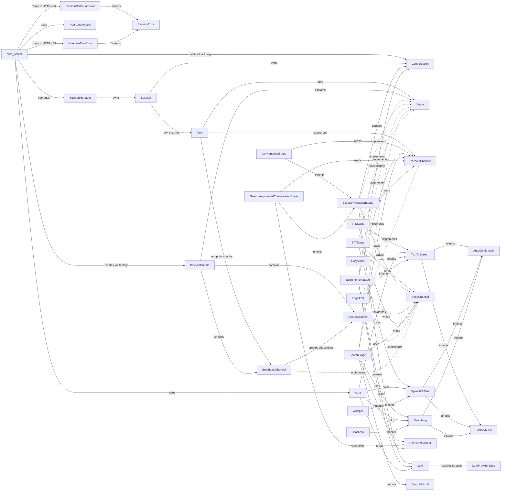

# Aura Gateway 模块依赖全景图

## 图1：类定义（不含关系）

| 类名 | 类型/标记 | 字段与方法 |
| --- | --- | --- |
| `aura_server` | - | `+upload(audio_file, session_id)` `+text_stream(session_id)` `+audio_stream(session_id)` `+interrupt(session_id)` `+session_complete(session_id)` |
| `Aura` | - | `+tts: TextToSpeech` `+stt: SpeechToText` `+searching: Searching` `+llm: LLM` |
| `SessionManager` | - | `-_sessions: dict~str, Session~` `+get_session(session_id) Session` `+start_turn(session_id, build) Session` `+interrupt_session(session_id) bool` `+complete_session(session_id) bool` `+subscribe(session, channel_name) ReceiveChannel` `+stream(session, channel_name)` |
| `SessionError` | `<<exception>>` | - |
| `SessionNotFoundError` | `<<exception>>` | - |
| `NoActiveTurnError` | `<<exception>>` | - |
| `Session` | - | `+session_id: str` `+conversation: Conversation` `-_current_turn: Turn` `+start_turn(bundle) Turn` `+interrupt_current_turn() bool` `+release() None` |
| `Turn` | - | `+stages: list~Stage~` `+channels: list~Any~` `+endpoints: dict~str, Any~` `+start(name) None` `+cancel() None` `+subscribe(name) ReceiveChannel` |
| `Conversation` | - | `+session_id: str` `+history: list~dict~` `+append_user(text) None` `+append_assistant(text) None` `+messages(system_prompt, extra_system_messages) list~dict~` `+recent_history(limit) list~dict~` |
| `PipelineBundle` | - | `+stages: list~Stage~` `+channels: list~Any~` `+endpoints: dict~str, Any~` |
| `Stage` | `<<protocol>>` | `+run() None` |
| `STTStage` | - | `-_stt: SpeechToText` `-_buffer: BytesIO` `-_out: SendChannel~str~` `+run() None` |
| `BaseConversationStage` | - | `-_llm: LLM` `-_conversation: Conversation` `-_out: SendChannel~str~` `+run() None` `#_prepare_turn() tuple~str, list~` `#_stream_reply(messages) str` |
| `ConversationStage` | - | `-_inp: ReceiveChannel~str~` `#_prepare_turn() tuple~str, list~` |
| `SearchIntentStage` | - | `-_llm: LLM` `-_conversation: Conversation` `-_inp: ReceiveChannel~str~` `-_out: SendChannel~UserTurnContext~` `+run() None` `-_plan(user_text) tuple~bool, str~` |
| `SearchStage` | - | `-_searching: Searching` `-_inp: ReceiveChannel~UserTurnContext~` `-_out: SendChannel~UserTurnContext~` `+run() None` |
| `SearchAugmentedConversationStage` | - | `-_inp: ReceiveChannel~UserTurnContext~` `#_prepare_turn() tuple~str, list~` `-_format_retrieval_context(turn) str` |
| `TTSStage` | - | `-_tts: TextToSpeech` `-_inp: ReceiveChannel~str~` `-_out: SendChannel~tuple~` `+run() None` |
| `UserTurnContext` | - | `+user_text: str` `+should_search: bool` `+search_query: str` `+search_results: list~SearchResult~` |
| `SendChannel` | `<<protocol>>` | `+send(item) None` `+close() None` |
| `ReceiveChannel` | `<<protocol>>` | `+receive()` `+__aiter__()` |
| `QueueChannel~T~` | - | `-_q: asyncio.Queue` `-_closed: bool` `+send(item) None` `+close() None` `+receive() T` `+replay(items, closed) None` |
| `BroadcastChannel~T~` | - | `-_history: list~T~` `-_subs: list~QueueChannel~` `-_closed: bool` `+subscribe() QueueChannel~T~` `+send(item) None` `+close() None` |
| `LLMProviderSpec` | - | `+name: str` `+parser: Callable` `+api_url_env: str` `+api_key_env: str` |
| `LLM` | - | `+provider: str` `+model_name: str` `+api_url: str` `+system_prompt: str` `+char_separators: set` `+char_batch_size: int` `+generate(messages, think)` `+parse_response(response)` `+generate_text(messages, think) str` |
| `TextToSpeech` | `<<abstract>>` | `+text_to_speech(text) bytes` `+_text_to_speech(text) bytes` `+build(config) TextToSpeech` |
| `CosyVoice` | - | `+api_url: str` `+voice: str` `+_text_to_speech(text) bytes` |
| `EdgeTTS` | - | `+voice: str` `+_text_to_speech(text) bytes` |
| `SpeechToText` | `<<abstract>>` | `+speech_to_text(audio_buffer) str` `+build(config) SpeechToText` |
| `Whisper` | - | `+model` `+language: str` `+prompt: str` `+speech_to_text(audio_buffer) str` |
| `Searching` | `<<abstract>>` | `+search(query, limit) list~SearchResult~` `+build(config) Searching` |
| `SearXNG` | - | `+api_url: str` `+search(query, limit) list~SearchResult~` |
| `SearchResult` | - | `+title: str` `+url: str` `+content: str` |
| `FactoryMixin` | `<<mixin>>` | `+register_impl()` `+get_impl(name)` `+build(config)` |
| `AutoConfigMixin` | `<<mixin>>` | `+_params: list` |
| `HeartbeatAssets` | - | `+content_mp3: bytes` `+content_duration_s: float` `+silence_mp3: bytes` `+silence_duration_s: float` `+enabled: bool` |

## 图2：类间关系（非类图）

