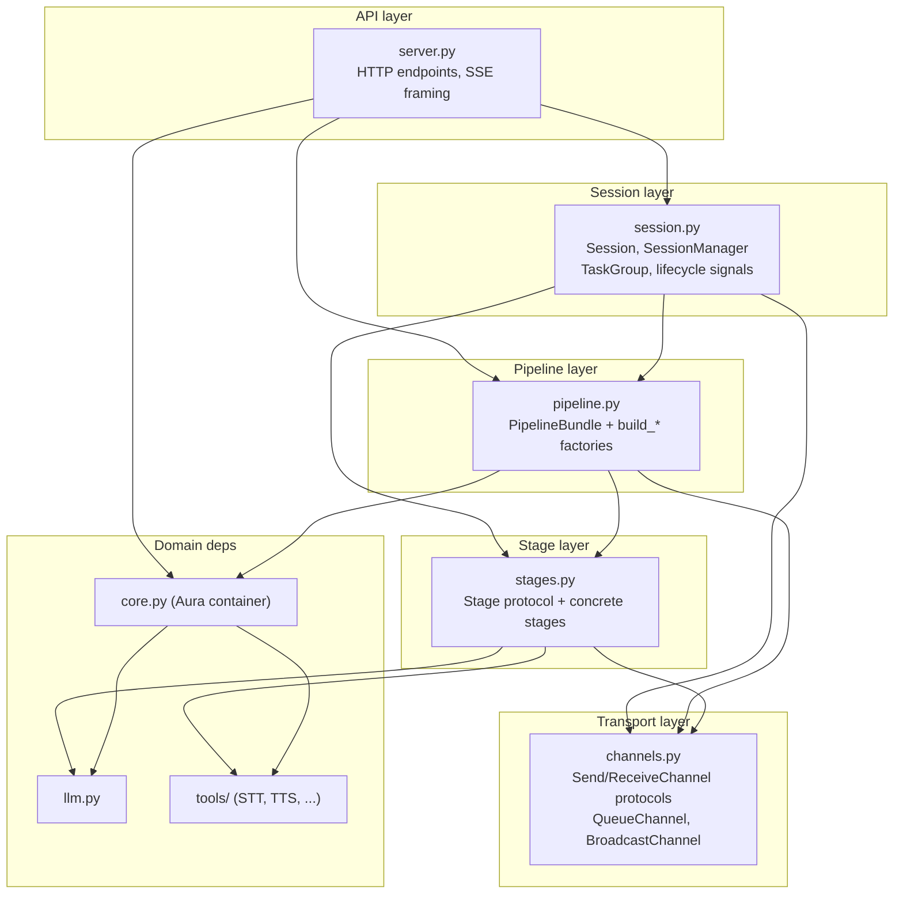
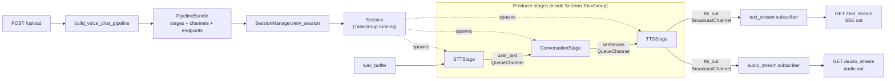
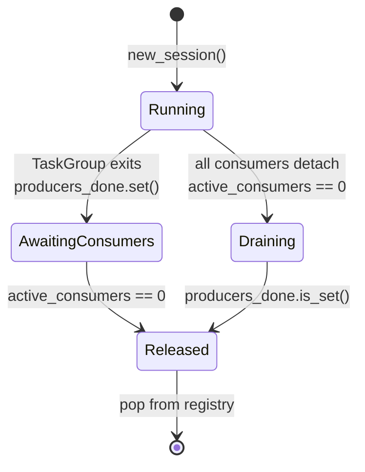

# Aura Gateway

FastAPI gateway that stitches STT (faster-whisper) → LLM (Ollama) → TTS
(EdgeTTS / CosyVoice) into a single HTTP-level voice-chat pipeline. The
flow runs as cooperating async producers backed by typed channels.

## Architecture

The code is organized as a **layered stack**. Each layer depends only on
the layers below it.



### What each layer owns

- **Transport** (`channels.py`) — `SendChannel` / `ReceiveChannel` protocols,
  plus `QueueChannel` (1→1 / N→1) and `BroadcastChannel` (1→N fan-out with
  late-subscriber replay). Business code never touches `asyncio.Queue`.
- **Stage** (`stages.py`) — pure business coroutines. A Stage is any object
  with `async def run()`. Dependencies and channels are injected via its
  constructor.
- **Pipeline** (`pipeline.py`) — a `build_*` factory that instantiates
  channels, instantiates stages with explicit wiring, and returns a
  `PipelineBundle(stages, channels, endpoints)`.
- **Session** (`session.py`) — runs one Pipeline instance inside
  `asyncio.TaskGroup`; tracks two independent lifecycle signals
  (`producers_done` event + `active_consumers` count) to release state
  safely when both producers and consumers are done.
- **API** (`server.py`) — FastAPI endpoints. Handles SSE framing and
  audio response headers; does not know anything about Stage internals.

## Runtime data flow (voice-chat pipeline)

One `/upload` spins up a Session; the two subsequent `GET`s subscribe to a
broadcast channel that the TTS stage publishes to.



## Session lifecycle

Producer and consumer lifecycles are tracked separately. A Session is only
released when **both** the producer TaskGroup has finished and no HTTP
stream subscribers remain attached.



## Extension points

Only two surfaces are meant to grow:

1. **Add a Stage** — define a class that takes its dependencies and
   channel references in `__init__`, and implements `async def run()`.
   Close its output channel(s) in `finally` so downstream terminates
   naturally (no `[DONE]` sentinels).
2. **Add a Pipeline** — write a new `build_xxx(...)` factory in
   `pipeline.py` that instantiates channels, instantiates stages, and
   returns a `PipelineBundle`. `Session` / `SessionManager` / `channels.py`
   do not need to change.

The same Stage class can appear multiple times in one pipeline with
different wiring, since each `XxxStage(...)` instantiation is independent
(e.g. a `SearchStage` used both for pre-retrieval and post-hoc
verification).

## Running

```bash
uv sync
uv run python server.py
```

Config is assembled from dataclass defaults in `config.py` and optionally
overridden by `config.yaml` next to it.
