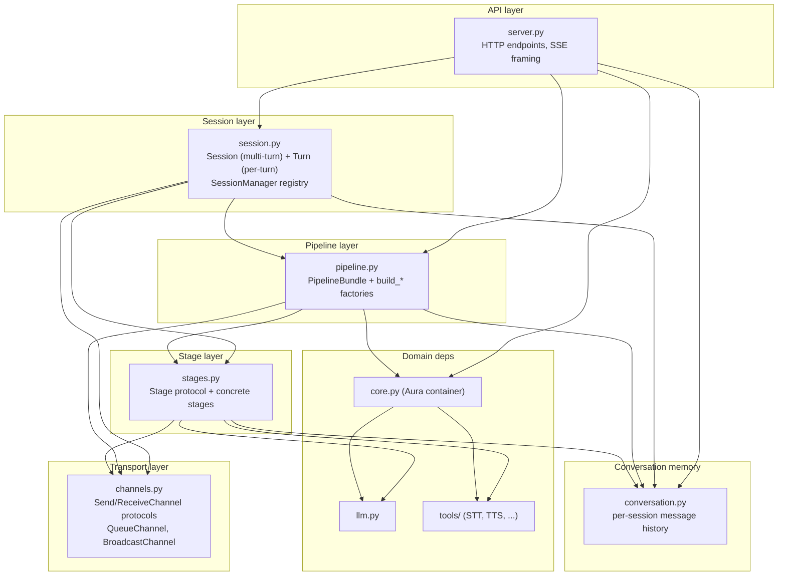
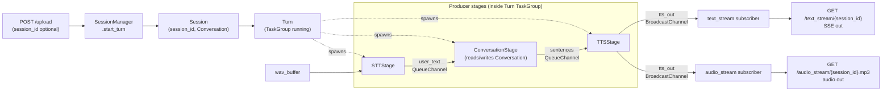
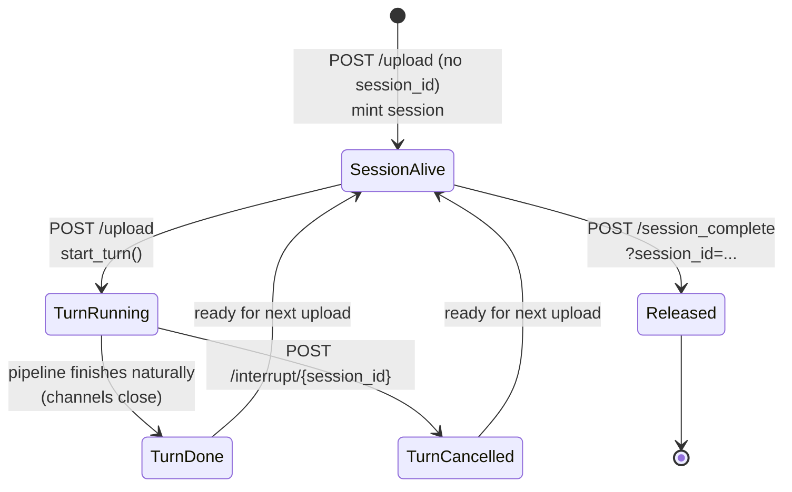

# Aura Gateway

FastAPI gateway that stitches STT (faster-whisper) → LLM (Ollama) → TTS
(EdgeTTS / CosyVoice) into a single HTTP-level voice-chat pipeline. The
flow runs as cooperating async producers backed by typed channels, and
the **whole device-side dialog (state0→state6) lives under one stable
`session_id`** — there is no separate "task id".

## Architecture

The code is organized as a **layered stack**. Each layer depends only on
the layers below it.



### What each layer owns

- **Transport** (`channels.py`) — `SendChannel` / `ReceiveChannel` protocols,
  plus `QueueChannel` (1→1 / N→1) and `BroadcastChannel` (1→N fan-out with
  late-subscriber replay). Business code never touches `asyncio.Queue`.
- **Stage** (`stages.py`) — pure business coroutines. A Stage is any object
  with `async def run()`. Dependencies and channels are injected via its
  constructor. `ConversationStage` reads/writes the per-session
  `Conversation` so multi-turn context survives across Turns.
- **Pipeline** (`pipeline.py`) — a `build_*` factory that instantiates
  channels, instantiates stages with explicit wiring (including the
  injected `Conversation`), and returns a
  `PipelineBundle(stages, channels, endpoints)`.
- **Conversation memory** (`conversation.py`) — a thin dataclass holding
  the `(role, content)` history for one `session_id`. Lives on the
  `Session`; injected into `ConversationStage` at pipeline-build time.
- **Session** (`session.py`) — `Session` is the multi-turn container
  identified by `session_id`; it owns the `Conversation` and exactly one
  in-flight `Turn`. `Turn` is what used to be the single-turn `Session`:
  it runs the pipeline inside `asyncio.TaskGroup` and closes all channels
  in `finally` so SSE / audio consumers iterating with `async for` always
  unwind cleanly.
- **API** (`server.py`) — FastAPI endpoints. Handles SSE framing and
  audio response headers; does not know anything about Stage internals.

## Runtime data flow (voice-chat pipeline)

One `/upload` either creates a Session (if no `session_id` is passed) or
reuses an existing one, then starts a fresh Turn against it. The two
subsequent `GET`s subscribe to the broadcast channel that the Turn's TTS
stage publishes to.



## Session / Turn lifecycle

A `Session` lives across the entire dialog and is **only** released by an
explicit `/session_complete`. A `Turn` lives for one upload-and-stream
cycle.



## HTTP endpoints

| Method | Path | Purpose | Device FSM trigger |
|---|---|---|---|
| `POST` | `/api/aura/upload` | Start a Turn. Body is multipart with `audio_file` (PCM) and **optional** `session_id` form field. Returns `{"session_id": "..."}` — a freshly minted id when none was sent, or the same id when continuing. | state 2 (uploading) |
| `GET`  | `/api/aura/text_stream/{session_id}` | SSE: `{"token": ...}` per sentence, terminated by `[DONE]`. | state 2/3 (responding) |
| `GET`  | `/api/aura/audio_stream/{session_id}.mp3` | Streaming MP3 of TTS audio for the current Turn. | state 2/3 (responding) |
| `POST` | `/api/aura/interrupt/{session_id}` | Cancel the current Turn; SSE / audio streams close cleanly. **The Session and its conversation memory live on**, ready for the next upload to continue the dialog. | state 4 (interrupting) |
| `POST` | `/api/aura/session_complete?session_id=...` | End the dialog: cancel any in-flight Turn AND drop the Session from the registry (releasing conversation memory). | state 6 (sessionEnd) |

Auth: every endpoint requires the `X-Aura-Token` header (or `?token=` query
for the audio stream so it can be embedded in a URL).

### `session_id` contract

The device follows this rule:

- **First turn of a dialog** (right after wake-word in state 0): `/upload`
  is sent **without** `session_id`. The cloud mints a new id and returns
  it. The device caches it locally as `_currentSessionId`.
- **Every subsequent turn** in the same dialog (continuations after
  state 5, or restarts after state-4 interrupts): `/upload` is sent
  **with** the cached `session_id`. The cloud keeps the same Session and
  reuses its `Conversation` history, so the LLM sees the full context.
- **`/interrupt/{session_id}`** kills only the current Turn. The Session
  is preserved on purpose, since the device is about to upload again
  with the same `session_id`.
- **`/session_complete?session_id=...`** is the only call that releases
  the Session. After this, the device clears its local id; the next
  dialog starts fresh.

If the cloud receives an `/upload` carrying an unknown `session_id` (e.g.
after a server restart), it logs a warning, mints a brand-new Session,
and returns the new id. The device then adopts the new id for the rest
of that dialog (history before the restart is gone, but the user can
keep talking).

### Interrupt / session-complete semantics

Both endpoints are **idempotent and forgiving** — missing or already-gone
ids return `{"status": "noop"}`, never an error.

- `interrupt`: cancels the in-flight Turn's runner `asyncio.Task`. The
  `TaskGroup` cancels every Stage; each Stage's `finally` (plus the
  safety net in `Turn._run`) closes its output channel(s); SSE / audio
  consumers iterating with `async for` receive a clean stream-end. The
  Session itself stays in the registry.
- `session_complete`: does everything `interrupt` does AND drops the
  Session from the registry, releasing the `Conversation` history.

## Audio-stream keepalive

The first real TTS chunk on `audio_stream` only arrives after STT +
LLM + first-sentence-TTS have all finished — easily 10–20 s on a cold
model. Two things go wrong if we just leave the HTTP body silent
during that gap:

1. **Socket abort** — the device-side player has a ~30 s read-timeout
   and bails with a "流式连接失败" toast.
2. **Pre-buffer-until-doomsday** — Android `MediaPlayer` (used on-device
   through `audioplayers`) refuses to start playing while byte arrival
   rate stays below the audio playback rate. Sending one ~1 s clip
   every 10 s (10 % of playback rate) makes it accumulate everything
   and dump it all at once when real TTS finally bursts in faster than
   realtime. Symptom: "two heartbeats and the reply all glued together
   at the very end".

`audio_stream` mitigates both by synthesising a continuous MP3 byte
stream while waiting for the first real chunk, made of two
pre-encoded assets:

- **`assets/heartbeat.mp3`** — the audible cue you want the user to
  hear (silence, soft "嗯", breath, room tone, …). Re-encoded at
  startup via `ffmpeg` to match the live TTS frame format. Emitted
  every `config.streaming.heartbeat_interval_s` seconds (default 10).
- **A short silence clip** — generated at startup from `anullsrc` at
  the same format. Emitted on every padding tick (~250 ms) to keep
  cumulative byte rate slightly above the player's playback rate, so
  the device starts emitting sound within a few hundred milliseconds
  instead of buffering everything.

As soon as a real TTS chunk lands, the synthesised stream stops and we
forward producer output verbatim (with each chunk's leading ID3v2 tag
stripped) until the Turn ends.

Why the format-matching matters: `MediaPlayer` locks onto the format
parameters (sample rate / channel count / bitrate) of the very first
MP3 header it parses, and silently drops later frames whose params
disagree. That is exactly what produced the earlier regression where
the heartbeat played audibly but the real reply went silent. The
re-encode also strips ID3v2 / Xing headers, and `audio_stream` strips
ID3v2 from each TTS chunk on the way out, so the whole HTTP body ends
up as one flat sequence of MP3 frames at one consistent format.

If `ffmpeg` is missing or the asset is unreadable, heartbeats are
silently disabled and behaviour falls back to raw passthrough.

## Extension points

Only two surfaces are meant to grow:

1. **Add a Stage** — define a class that takes its dependencies and
   channel references in `__init__`, and implements `async def run()`.
   Close its output channel(s) in `finally` so downstream terminates
   naturally (no `[DONE]` sentinels).
2. **Add a Pipeline** — write a new `build_xxx(...)` factory in
   `pipeline.py` that instantiates channels, instantiates stages, and
   returns a `PipelineBundle`. `Session` / `Turn` / `SessionManager` /
   `channels.py` do not need to change.

The same Stage class can appear multiple times in one pipeline with
different wiring, since each `XxxStage(...)` instantiation is independent
(e.g. a `SearchStage` used both for pre-retrieval and post-hoc
verification).

## Running

```bash
uv sync
uv run python server.py
```

Config is assembled from dataclass defaults in `config.py` and optionally
overridden by `config.yaml` next to it.
